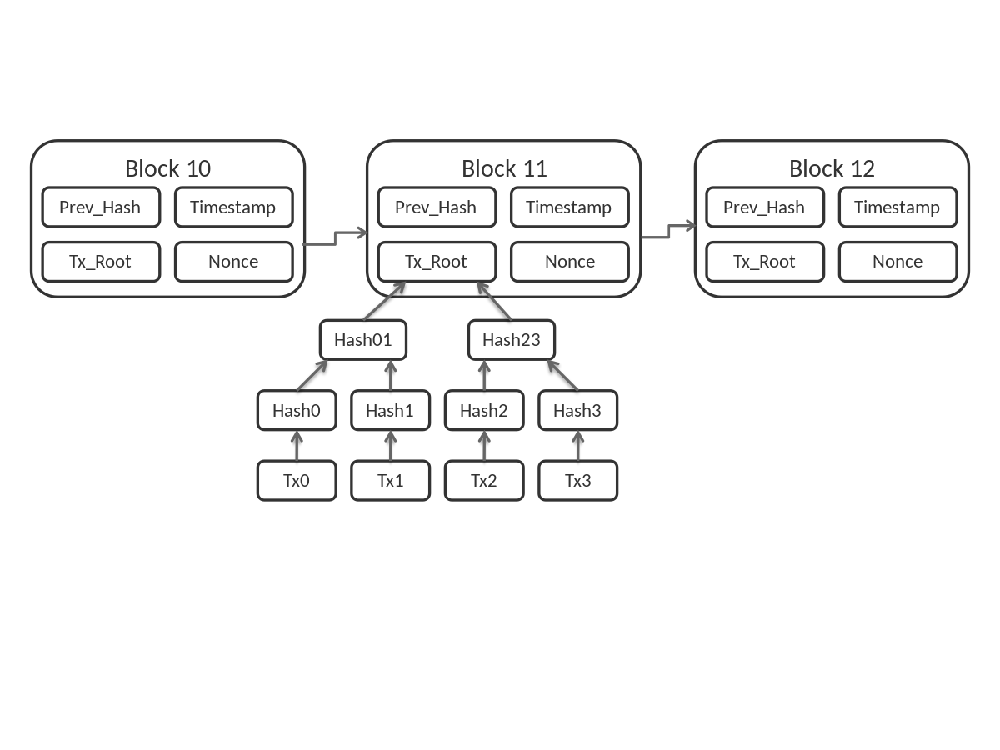
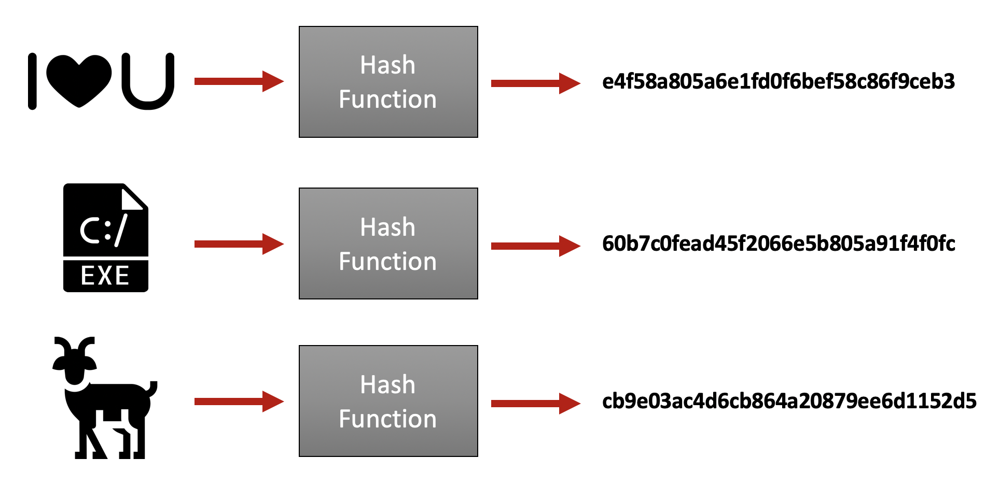
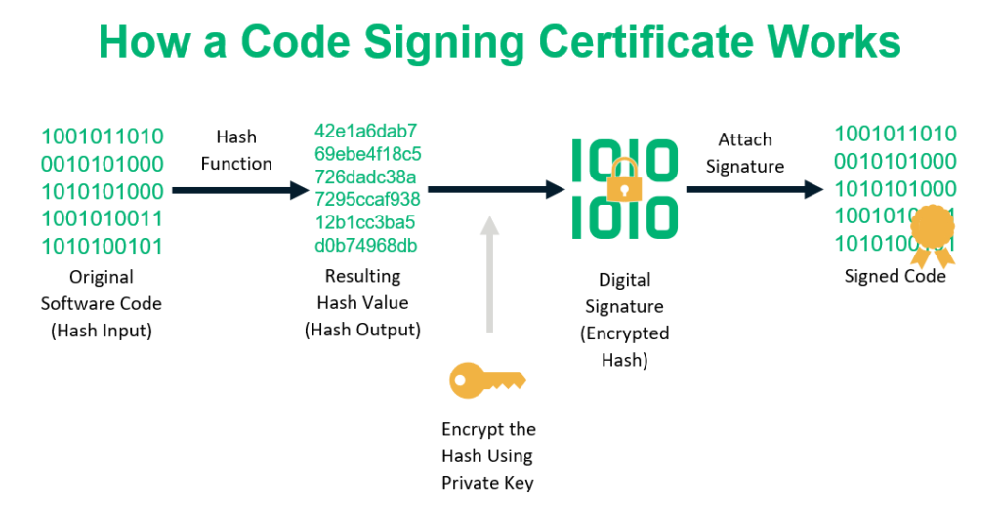
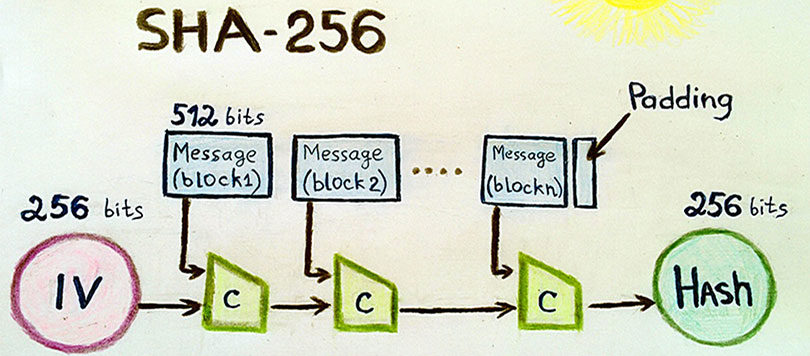

<div align="center">

</div>

<h1>Name and Number</h1>

```
Yusuf Çelik
20170808006
```

<h1> Methodology and Findings </h1>

```
I made a cryptocurrency application with blockchain.
Backend side is coded with python and frontend side is coded with javascript with react framework
```

<h3> Blockchain </h3>
```
Blockchain is a growing list of records, called blocks,that are linked together using cryptography.
Each block contains a cryptographic hash of the previous block a timestamp and transaction data.
Blockchain invented a person using the name Satoshi Nakamoto in 2008 to serve as the public transaction ledger of the cryptocurrency bitcoin.
```

<h3> Blockchain Structure </h3>
<div align="center">

</div>

<h3>cryptography Library  </h3>
```
cryptography is a package which provides cryptographic recipes and primitives to Python developers.
First version of cryptography's 0.1 is released in 9 January 2014.I used Elliptic-curve cryptography and SHA-256
```
<h3>Elliptic-curve cryptography </h3>
```
ECC is an approach to public-key cryptography based on the algebraic structure of elliptic curves over finite fields. 
ECC allows smaller keys compared to non-EC cryptography (based on plain Galois fields) to provide equivalent security.
Elliptic curves are applicable for key agreement, digital signatures, pseudo-random generators and other tasks.
Indirectly, they can be used for encryption by combining the key agreement with a symmetric encryption scheme. 
They are also used in several integer factorization algorithms based on elliptic curves that have applications in cryptography, such as Lenstra elliptic-curve factorization.
```

<h3>Hash</h3>
```
Hash is any function that can be used to map data of arbitrary size to fixed-size values. 
The values returned by a hash function are called hash values, hash codes, digests, or simply hashes. 
The values are usually used to index a fixed-size table called a hash table. 
Use of a hash function to index a hash table is called hashing or scatter storage addressing.
```
<h3> Hashing</h3>
<div align="center">

</div>
<div align="center">

</div>

<h3>SHA-256  </h3>
```
SHA-256 is a set of cryptographic hash functions designed by the United States National Security Agency (NSA) and first published in 2001.
They are built using the Merkle–Damgård construction,from a one-way compression function itself built using the Davies–Meyer structure from a specialized block cipher.
SHA-2 includes significant changes from its predecessor, SHA-1. The SHA-2 family consists of six hash functions with digests (hash values) that are 224, 256, 384 or 512 bits: SHA-224, SHA-256, SHA-384, SHA-512, SHA-512/224, SHA-512/256. 
SHA-256 and SHA-512 are novel hash functions computed with eight 32-bit and 64-bit words, respectively. 
They use different shift amounts and additive constants, but their structures are otherwise virtually identical, differing only in the number of rounds. 
```
<h3> SHA-256 algorithm </h3>
<div align="center">

</div>

<h1> Youtube Link </h1>
<div align="center">
  <a href="https://www.youtube.com/watch?v=TzqlHTryYVc"></a>
</div>
<h1>Command Lines</h1>
**Activate the virtual environment**

```
.\venv\Scripts\activate
```

**Install all packages**

```
pip install  -r requirements.txt
```

**Run the application and API**
!!! Make sure the virtual environment is activated

```
python -m backend.app
```

**Run a peer instance**
!!! Make sure the virtual environment is activated

```
set "PEER=True" && python -m backend.app
```

**Run the frontend**

```
npm run start
```

**Seed_Data**
!!! Make sure the virtual environment is activated

```
set "SEED_DATA=True" && python -m backend.app
```
